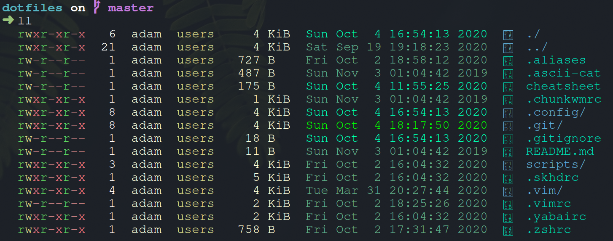
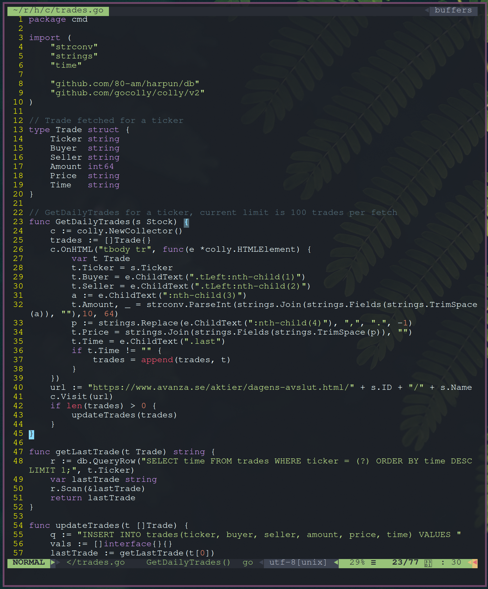
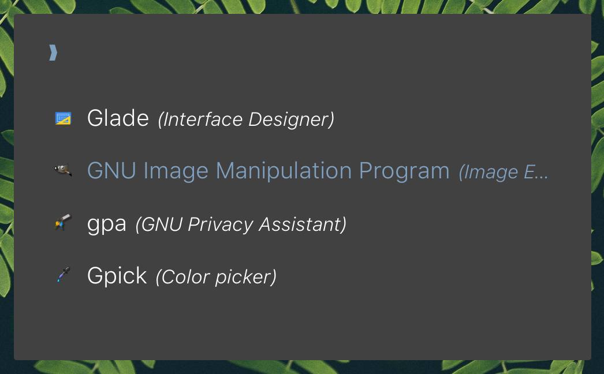

# dotfiles

<a href="./assets/linux.png"></a>

[colorls](#colorls) | [compton](#compton) | [dunst](#dunst) | [i3-gaps](#i3-gaps) | [nvim](#nvim) | [polybar](#polybar) | [rofi](#rofi) | [yabai](#yabai) | [zsh](#zsh)

## Installation

### [colorls](https://github.com/athityakumar/colorls)
Listing directory content.
<br>

```bash
ln -s .config/colorls $HOME/.config/colorls
```

### [compton](https://github.com/chjj/compton)
Compositor for x, makes it possible for transparency.

```bash
ln -s .config/compton.conf $HOME/.config/compton.conf
```

### [dunst](https://github.com/dunst-project/dunst)
Used as notification daemon.
<br>

```bash
ln -s .config/dunst $HOME/.config/dunst
```

### [i3-gaps](https://github.com/Airblader/i3)
Fork of i3wm, used as tiling window manager.
Install by creating symlink to directory and copy sample.

By default uses `alt` as modifier key.
```bash
ln -s .config/i3 $HOME/.config/i3
cp .config/i3/config.sample .config/i3/config
```

### [nvim](https://github.com/neovim/neovim)
My editor of choise.
<br>

Uses Vundle to handle plugins such as nerdtree and vim-airline.

```bash
ln -s .vimrc $HOME/.vimrc
ln -s .vim $HOME/.vim
ln -s .config/nvim $HOME/.config/nvim
```

### [polybar](https://github.com/polybar/polybar)
Highly customizable status bar.
<br>

```bash
ln -s .config/polybar $HOME/.config/polybar
```

### [rofi](https://github.com/davatorium/rofi)
Application launcher used instead of i3s default dmenu.
<br>

```bash
ln -s .config/rofi $HOME/.config/rofi
```

### [yabai](https://github.com/koekeishiya/yabai)
Tiling window management on macOS, similar i3-gaps for linux.
Keybinds is configured in `.skhdrc`.

By default uses `cmd` as modifier key.
```bash
ln -s .skhdrc $HOME/.skhdrc
ln -s .yabairc $HOME/.yabairc
```

### [zsh](https://github.com/ohmyzsh/ohmyzsh)
Z-shell used with oh-my-zsh config-framework.

```bash
git clone https://github.com/ohmyzsh/ohmyzsh.git
sh -c "$(wget -O- https://raw.githubusercontent.com/ohmyzsh/ohmyzsh/master/tools/install.sh)"
ln -s .zshrc $HOME/.zshrc
```